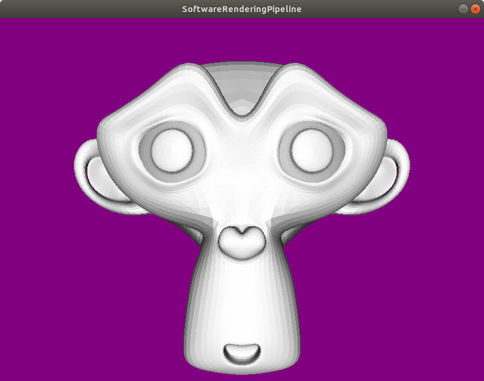

# SoftwareRenderingPipeline



## Building
This project requires SDL2, glm and assimp.
These can be installed on an Ubuntu system via the package manager:

```
$ sudo apt install -y libsdl2-dev libglm-dev assimp-utils libassimp-dev
```

Create a build directory and compile using CMake:
```
$ mkdir build && cd build
$ cmake ..
$ make
```

## Running

```
$ ./SoftwareRenderingPipeline
```

## References Litterature
* [Scratch A Pixel](https://www.scratchapixel.com/)
* [Tiny Renderer](https://github.com/ssloy/tinyrenderer/wiki)
* [Learn OpenGL](https://learnopengl.com/)
* [Rasterizer](https://github.com/Nickelium/Rasterizer)

## Reference Models and Textures
* Suzanne Blender, Blender Foundation
